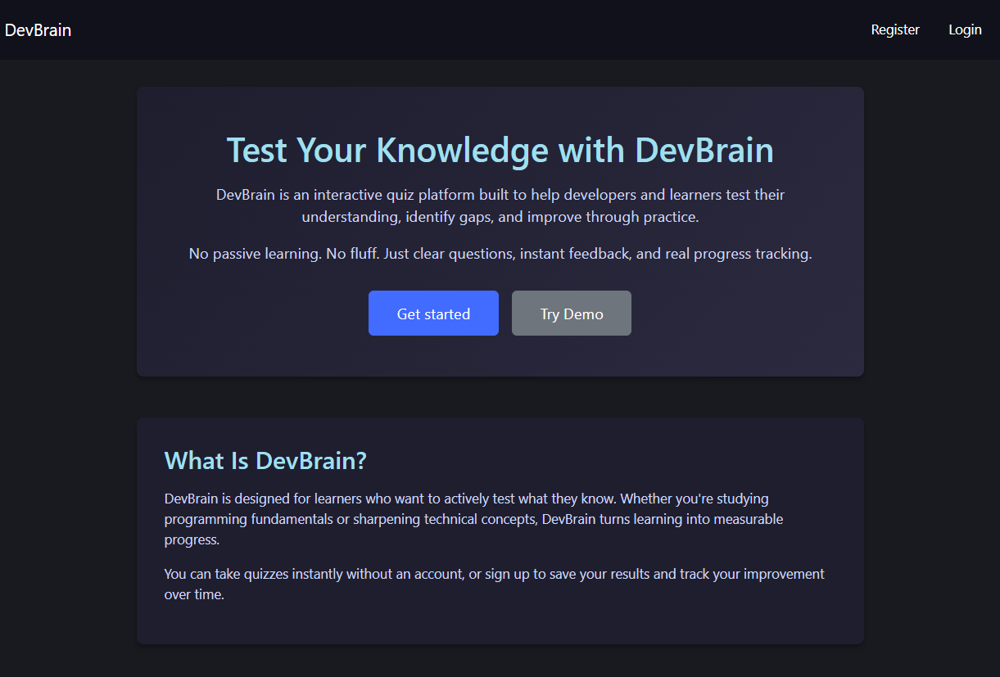

<div align=center>


#  


[](https://www.python.org/)
[]()

DevBrain is a simple web-based project focused on practicing and showcasing core frontend concepts using HTML and CSS. It demonstrates clean structure, layout organization, and basic user interface design fundamentals.

---
</div>




## Description

DevBrain is a web-based quiz application I built to help people actually test their programming knowledge instead of just reading about it. The idea came from realizing that most learning platforms are way too passive—you watch videos, read docs, but never really know if the info stuck. So I made something focused on active practice with instant feedback.

You can jump right in and take quizzes without an account, or register to track your progress over time. Either way works. The whole point is to make testing yourself as frictionless as possible.

---

## Project Structure
```
project/
│
├── app.py              # Main Flask app and routes
├── auth.py             # Authentication blueprint (login, register, password reset)
├── question.py         # Questions class that handles quiz logic
├── config.py           # Config vars (secret key, email creds, etc.)
├── schema.sql          # Database schema
├── database.db         # SQLite database (auto-generated)
├── requirements.txt    # Python dependencies
├── templates/          # Jinja2 HTML templates
│   ├── index.html
│   ├── quiz.html
│   ├── results.html
│   ├── history.html
│   ├── login.html
│   ├── register.html
│   ├── forgot_password.html
│   └── about.html
├── static/             # CSS files
└── flask_session/      # Session data (auto-created)
```

## How It Works

The app is pretty straightforward: pick a topic (or multiple topics), choose your difficulty level, decide how many questions you want, and go. After each question, you get instant feedback on whether you got it right. At the end, you see your score, percentage, and a grade ranging from "Needs Improvement" to "Mastery."

If you're logged in, all your quiz attempts get saved to a history page where you can see patterns in your performance. It's honestly kind of humbling to look back and see how many times you bombed SQL questions before finally getting it.

One thing I spent way too much time on: the topics. I initially scraped the quiz site with BeautifulSoup (bs4) because the topics shown on their homepage didn't match what their API actually returned. Classic case of frontend vs backend data mismatch. Eventually I just hardcoded a list of verified topics after testing each one individually. Not elegant, but it works.

---

## Features

- Take quizzes by topic and difficulty – Mix and match topics, choose Easy/Medium/Hard  
- Instant scoring and feedback – No waiting, you know immediately if you're right or wrong  
- Optional user accounts – Try quizzes anonymously or register to save history  
- Quiz history tracking – See all past attempts, scores, and grades over time  
- Password reset via email – Because everyone forgets passwords  
- Clean interface – No clutter, just questions and answers  

---

## Tech Stack

**Backend:** Python, Flask  
**Frontend:** HTML, Jinja2, Bootstrap (minimal styling)  
**Database:** SQLite  
**Sessions:** Flask-Session (filesystem-based)  
**Forms & Security:** Flask-WTF (CSRF protection), Werkzeug (password hashing), itsdangerous (reset tokens)  
**Email:** Flask-Mail with Gmail SMTP  

I went with Flask because it's lightweight and doesn't force a million opinions on you. SQLite made sense for a single-user-focused app—no need for Postgres overkill. The session management is file-based which is honestly overkill for what I needed, but I wanted to avoid signed cookies and it was easy to set up.

## Database

The app uses SQLite with a single database file: `database.db`  
It's automatically created on first run if it doesn't exist, using the schema defined in `schema.sql`. No manual setup needed.

### Database Initialization

```python
DATABASE_PATH = "database.db"

def init_db():
    if not os.path.exists(DATABASE_PATH):
        with sqlite3.connect(DATABASE_PATH) as conn:
            with open("schema.sql", "r") as f:
                conn.executescript(f.read())

init_db()
```

This runs every time the app starts. If the database is missing, it builds it. If it exists, it does nothing. Simple.

### Database Schema

There are two main tables:

**users**
- `id` – Primary key
- `email` – Unique, used for login and password resets
- `username` – Display name
- `password` – Hashed with Werkzeug

**quizzes**
- `id` – Primary key
- `user_id` – Foreign key to users table
- `topic` – Quiz topic(s), comma-separated if multiple
- `difficulty` – EASY, MEDIUM, or HARD
- `question_count` – Number of questions in the quiz
- `score` – Number of correct answers
- `grade` – Text grade (Mastery, Competent, etc.)
- `date` – Timestamp, defaults to current time

---

## Dependencies

I tried to keep the dependency list short. Here's what the project uses:

### Third-Party (install via pip)
- **Flask** – Core web framework
- **Jinja2** – Template rendering (comes with Flask)
- **Flask-Session** – Server-side session management
- **Flask-WTF** – Form handling and CSRF protection
- **Flask-Mail** – Email sending for password resets
- **Werkzeug** – Password hashing and security
- **itsdangerous** – Secure token generation
- **Requests** – HTTP requests (used in question fetching)

### Python Standard Library (no install needed)
- **sqlite3** – Database
- **smtplib** – Email sending
- **functools** – For decorators like `@login_required`
- **os** – File operations

Everything needed is in `requirements.txt`.

---

## Installation & Setup

1. **Clone the repo:**
```bash
   git clone <repository-url>
   cd project
```
2. **Set up a virtual environment (recommended):**
```bash
   python -m venv .venv
   source .venv/bin/activate   # macOS/Linux
   .venv\Scripts\activate      # Windows
```

3. **Install dependencies:**
```bash
   pip install -r requirements.txt
```

4. **Configure email settings:**
   
   You'll need to set up Gmail credentials in `config.py` for password reset emails to work. Create an app-specific password through your Google account settings (requires 2FA enabled).
```python
   # config.py
   SECRET_KEY = "your-secret-key-here"
   EMAIL = "your-email@gmail.com"
   EMAIL_PASSWORD = "your-app-password"
```

5. **Run the app:**
```bash
   python app.py
```
   or
```bash
   flask run
```

The database will be created automatically on first run if it doesn't exist.

---

## Usage

1. Visit the homepage and click "Start Quiz"
2. Select topic(s), difficulty, and number of questions
3. Answer questions and get instant feedback
4. See your final score and grade
5. Optionally register an account to save your history
6. View past quiz attempts on the History page

### Grade Scale

- **Mastery:** 90%+
- **Competent:** 75-89%
- **Average:** 60-74%
- **Fair:** 40-59%
- **Needs Improvement:** Below 40%

---

## Key Routes

### Public Routes
- `GET /` – Homepage
- `GET /about` – About page
- `GET /quiz` – Quiz topic selection
- `POST /quiz` – Start quiz or submit answers
- `GET /login` – Login page
- `POST /login` – Login form submission
- `GET /register` – Registration page
- `POST /register` – Register new user
- `GET /forgot_password` – Password reset request
- `POST /forgot_password` – Send reset email
- `GET /reset_password/<token>` – Reset password form
- `POST /reset_password/<token>` – Update password

### Protected Routes (login required)
- `GET /history` – View quiz history
- `GET /logout` – Clear session and log out

---

## Design Decisions

### Why Flask?
I wanted something lightweight that wouldn't impose too many opinions. Django felt like overkill for this. Flask let me structure things my way without fighting a framework.

### Why SQLite?
For a project like this, SQLite is perfect. It's built into Python, requires zero configuration, and works great for single-user or small-scale apps. If I ever needed to scale, migrating to Postgres would be straightforward.

### Why filesystem sessions?
I didn't want session data in cookies (security concern) and didn't want to set up Redis just for session storage. Flask-Session with filesystem backend was a good middle ground—simple, secure enough, and works out of the box.

### The BeautifulSoup scraping thing
Yeah, this was annoying. The quiz API I'm using has a website that lists topics like "JavaScript," "Python," "CSS," etc. But when you actually query the API with those exact strings, it returns empty results for some of them. Turns out the API uses different internal topic names. I spent an hour trying different variations before just scraping the site with bs4 to confirm what topics actually exist, then manually testing each one against the API. Now I have a hardcoded `DEFAULT_TOPICS` list in `question.py` that I know works. Not pretty, but functional.

### Session management
Quiz state (questions, current score, question count) is stored in Flask sessions. This means if you close your browser mid-quiz without logging in, your progress is gone. That's intentional—I didn't want to clutter the database with incomplete quiz attempts from anonymous users. If you're logged in, only completed quizzes get saved.

### The forgot_password.html trick
This one's kind of genius if I say so myself. I'm using the same template (`forgot_password.html`) to handle four different states: requesting a reset, showing the "email sent" message, the actual reset form, and the success confirmation. I just pass a `form_type` variable that switches between them. Saves me from making four separate HTML files for what's essentially the same page with different content. The routes themselves (`/forgot_password` and `/reset_password/<token>`) are separate because they handle different logic, but they both render the same template with different parameters.

### CSRF exemption for auth routes
You might notice in `app.py` I exempt the entire auth blueprint from CSRF protection:
```python
csrf.exempt(auth)  # Exempt auth routes from CSRF protection since it's pre-login
```

This was a deliberate choice. Routes like `/login`, `/register`, `/forgot_password`, and `/reset_password/<token>` are all pre-authentication endpoints. Users hitting these routes don't have sessions yet, so enforcing CSRF tokens doesn't really make sense. Plus, it would break the password reset flow since users are coming from email links, not from within the app itself. Once you're logged in and hitting routes like `/quiz` or `/history`, CSRF protection kicks in.

The password reset routes being "unprotected" isn't a security issue either—the security comes from the token itself, which is time-limited (1 hour) and cryptographically signed using `itsdangerous`. Even if someone intercepts the reset link, they'd need to use it within that hour window, and the token can only be used once since it updates the password hash in the database.

---

## Security Features

- **Password hashing:** Werkzeug's `generate_password_hash` and `check_password_hash`
- **CSRF protection:** Flask-WTF on all authenticated routes
- **Secure password reset:** Token-based with 1-hour expiry using itsdangerous
- **Session-based auth:** No JWT complexity, just simple server-side sessions
- **No-cache headers:** Prevents browsers from caching sensitive pages
- **Email obfuscation:** Password reset always shows "email sent" message regardless of whether the email exists (prevents user enumeration)

---

## Known Limitations

- **Email only works with Gmail:** You'll need a Gmail account with an app-specific password. Other SMTP providers would need different config.
- **No question explanations:** Right now, you just get told if you're right or wrong. No explanation of why. Would be a good future addition.
- **Limited question pool:** Depends entirely on the external API I'm using. If it's down, the app doesn't work.
- **No admin panel:** Can't add/edit/delete questions through the UI. Everything comes from the API.

---

## What I Learned

This was my first "real" Flask project and honestly, I learned more from the annoying parts than the stuff that worked on the first try. Debugging the topic mismatch issue taught me that you can't always trust APIs to match their documentation (or their own website). Setting up email with Flask-Mail was weirdly harder than I expected—Gmail's security settings are no joke.

I also learned that session management is more nuanced than I thought. Initially I tried using signed cookies, but they have size limits and I was storing entire quiz question lists in them. Switching to filesystem sessions fixed that, though it means the app isn't fully stateless anymore. Trade-offs.

The grading system went through a few iterations. Originally I had letter grades (A, B, C, etc.) but they felt too school-y. The current text-based grades feel more friendly and less judgy.

The auth flow took longer to nail down than I expected. Getting the password reset working with email tokens, handling edge cases (expired tokens, invalid emails, etc.), and making sure everything was secure without being annoying to use was a balancing act. The decision to use one template for all password reset states came pretty late in development and honestly saved me a lot of time.

---

## Future Improvements

- Let users create custom quizzes
- Add a leaderboard (maybe?)
- Support more quiz sources/APIs
- Better mobile styling
- Export quiz history as CSV
- Add a "practice weak topics" feature that automatically generates quizzes from your worst-performing categories

---

## Author

Built by Richard as my CS50 Final Project. The goal was to demonstrate backend web development with Flask, SQLite, and authentication flows. Also wanted to make something actually useful that I'd use myself.

If you have questions or find bugs, feel free to reach out or open an issue.

---

## License

MIT License – use it, modify it, break it, whatever.
