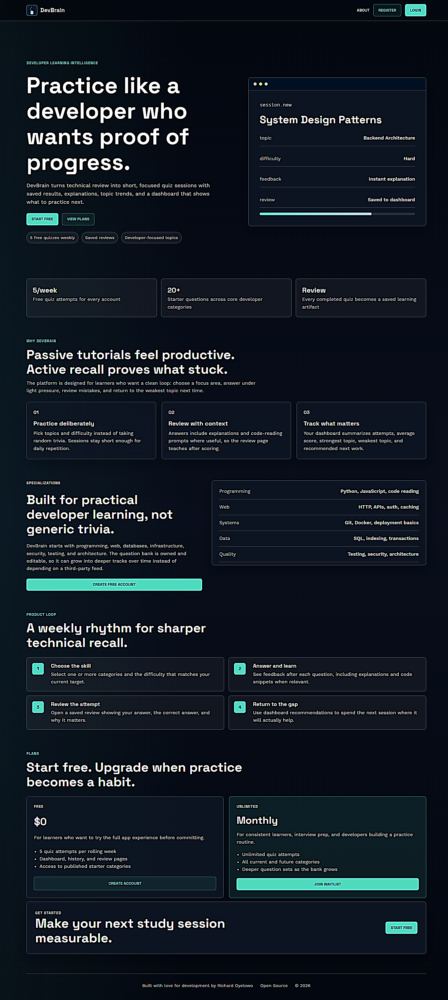

<div align="center">

# 

[](LICENSE)
[](https://www.python.org/)
[](https://flask.palletsprojects.com/)
[](https://github.com/RichardOyelowo/DevBrain)

</div>

DevBrain is a developer learning and quiz platform built for active practice. You register, pick a topic and difficulty, take a focused quiz, review what you got wrong with full explanations, and watch your progress build up over time. Admins manage the question bank directly from the site using a structured JSON import workflow. No external quiz API involved.

---



---

## Table of Contents

- [Description](#description)
- [Current MVP](#current-mvp)
- [Features](#features)
- [Tech Stack](#tech-stack)
- [Quick Start](#quick-start)
- [Configuration](#configuration)
- [Architecture Overview](#architecture-overview)
- [Database and Models](#database-and-models)
- [Question Import Format](#question-import-format)
- [User Flow](#user-flow)
- [Admin Flow](#admin-flow)
- [Routes](#routes)
- [Frontend Structure](#frontend-structure)
- [Testing](#testing)
- [Project Structure](#project-structure)
- [Architecture Decisions](#architecture-decisions)
- [Security Notes](#security-notes)
- [Known Limitations](#known-limitations)
- [What I Learned](#what-i-learned)
- [Roadmap](#roadmap)
- [Author](#author)
- [License](#license)

---

## Description

DevBrain started as my CS50 Final Project -- a basic quiz app that pulled questions from an external API. That version worked but it had real problems. The quiz experience depended on a third-party API staying up. There was no control over what questions users saw. No history, no review, no admin tools. It was a demo, not a product.

This MVP is a completely different thing. The question bank is owned and stored in the database. Admins import questions through a structured JSON workflow, review drafts before publishing, and manage categories, languages, and fast-start presets from dedicated admin pages. Users register, take quizzes by topic and difficulty, get instant feedback on every answer, review their mistakes with explanations, and build a visible history of their progress.

The idea behind DevBrain is that most developer learning is passive. You watch a course, read a doc, follow a tutorial, and feel like you understand something. That feeling does not always hold up when you sit down and have to answer questions without the material in front of you. DevBrain is built around the idea that active testing is part of learning, not separate from it.

---

## Current MVP

The MVP is a Flask monolith with server-rendered Jinja templates. No external quiz API. No separate frontend framework. Questions live in the database and the admin controls them completely.

The current access model:

- Users have to register before taking quizzes
- Free accounts get 5 quiz attempts per rolling week
- Admin accounts have unlimited access
- The first account registered automatically becomes the admin
- Every account after the first is a regular user

Payments are not implemented yet -- the 5-quiz limit is enforced in app logic for now.

---

## Features

**Backend**
- SQLAlchemy models with Flask-Migrate support
- Database-backed learning tables: topics, languages, presets, questions, answer_options, quiz_attempts, quiz_attempt_answers, question_import_batches
- Legacy quizzes table kept for older summaries
- First registered user automatically becomes admin
- User roles: admin and normal user
- Free user quota enforced at 5 quiz attempts per rolling week
- Quiz generation from owned published questions, not external API
- Fallback question selection so quizzes still fill even when exact topic/difficulty matches are low
- Quiz selection ignores inactive and deprecated language topics, only picks from active categories
- Case-insensitive language matching at query time -- Python, python, and PYTHON all hit the same filter
- Seeded question bank with starter topics, languages, and presets via `flask init-db`
- PostgreSQL/Supabase-compatible config with `postgres://` to `postgresql://` normalization
- Removed stale QuizAPI helper and hardcoded topic source

**Question Import**
- Admins import questions by pasting JSON or uploading a `.json` file at `/admin/import`
- Imported questions are always saved as draft with `source="import"` for manual review before publishing
- Topics matched by `topic_id` or auto-created from a `topic` name field
- Supports options with `is_correct` flags or a `correct_option` index
- Import history tracked in the `question_import_batches` table with batch metadata
- Full validation on import payload with clear error messages
- `sample_question_import.json` included in the repo for testing the import flow

**Categories and Languages**
- 20 active non-language quiz categories
- 15 editable language filters: Python, JavaScript, TypeScript, SQL, PHP, Java, C#, C++, C, Go, Ruby, Rust, Swift, Kotlin, Shell
- Languages are separate from quiz categories and managed independently
- Fast-start quiz presets are database-driven, not hardcoded
- Category delete behavior: empty categories get deleted, categories with linked questions or presets get deactivated instead so existing content is not broken
- Language delete behavior: deletes the filter entry only, existing questions are not affected

**User App**
- Dashboard as the main logged-in landing page with total quizzes, average score, strongest topic, weakest topic, recent attempts, recommended practice, and quota status
- Full quiz flow: setup, question, results, review
- Saved answer tracking per attempt
- Instant answer feedback after each question
- Final results page with score, percentage, and grade
- Full review page showing your answer, the correct answer, and the explanation
- History page with filters by topic and difficulty and review links per attempt
- Profile page with account details, role, quota status, stats, and password change
- Login required for all quiz features

**Admin**
- Admin routes in a dedicated blueprint at `app/admin.py`, separated from general app routes
- Admin dashboard showing question bank stats: total topics, published questions, drafts, import batches
- Question import workflow at `/admin/import` -- paste JSON or upload a file
- Full question library with create and edit flows
- Category management at `/admin/topics` with delete/deactivate behavior
- Language management at `/admin/languages` with delete behavior
- Fast-start preset management at `/admin/presets`
- Question states: draft, published, archived
- Code-reading question support with language and code snippet fields
- Admin sidebar entry only visible to admin users; routes protected server-side

**Frontend**
- Split CSS architecture: base, layout, components, pages
- Logged-in app shell with desktop sidebar and mobile navigation
- Wide page layouts so quiz, history, profile, and admin screens are not cramped
- Mobile table behavior converts wide tables into readable card layouts
- Dark theme refined to feel more like a real product
- Homepage expanded with both quiz example types (code snippet and concept question), question styles section, learning signals, category strategy, MVP architecture overview, UX breakdown, question bank quality loop, and roadmap direction -- roughly 2-3x the previous marketing content
- About page expanded with project context, architecture breakdown, and MVP proof section
- New CSS styles for quiz examples, category cloud, signal grid, UX grid, and roadmap strips with responsive behavior

**Tests**
- 36 tests passing across 5 test files covering models, import workflow, services, quiz logic, dashboard stats, quota checks, editable catalogs, delete behavior, case-insensitive language filtering, and admin role behavior

---

## Tech Stack

| Layer | Technology | Purpose |
|---|---|---|
| Backend | Python, Flask | Main web application |
| Templates | Jinja2 | Server-rendered pages |
| ORM | SQLAlchemy | Models and queries |
| Migrations | Flask-Migrate, Alembic | Schema changes |
| Local DB | SQLite | Development |
| Production DB | PostgreSQL | Hosted persistence |
| Forms | Flask-WTF, WTForms | Login, register, reset, profile |
| Email | Flask-Mail | Password reset emails |
| Sessions | Flask sessions | User login state |
| Frontend | HTML, CSS, JavaScript | UI without a build step |
| Server | Gunicorn | WSGI production server |
| Tests | Python unittest | Model and service coverage |

---

## Quick Start

### 1. Clone the project

```bash
git clone https://github.com/RichardOyelowo/DevBrain.git
cd DevBrain
```

### 2. Create and activate a virtual environment

```bash
python -m venv venv
source venv/bin/activate  # Windows: venv\Scripts\activate
```

### 3. Install dependencies

```bash
pip install -r requirements.txt
```

### 4. Set up environment variables

```bash
cp .env.example .env
```

Edit `.env` with your local config. See [Configuration](#configuration) for all variables.

### 5. Run migrations and seed the database

```bash
flask --app run.py db upgrade
flask --app run.py init-db
```

The seed command creates starter topics, languages, presets, and published questions so the app is usable right after setup. Without it you will have an empty question bank.

### 6. Start the app

```bash
python run.py
```

Visit `http://localhost:5000`

The first account you register becomes the admin. Every account after that is a regular user.

---

## Configuration

| Variable | Required | Description |
|---|---|---|
| `SECRET_KEY` | Yes | Flask session signing key |
| `DATABASE_URL` | Yes | SQLAlchemy database URL |
| `EMAIL` | For password reset | Sender email address |
| `EMAIL_PASSWORD` | For password reset | SMTP password or app password |
| `MAIL_SERVER` | For password reset | SMTP server host |
| `MAIL_PORT` | For password reset | SMTP server port |
| `REDIS_URL` | Optional | Redis-backed sessions if needed |
| `FLASK_ENV` | Optional | Set to `development` locally |

Example local `.env`:

```env
SECRET_KEY=change-me
DATABASE_URL=sqlite:///instance/devbrain.db
EMAIL=devbrain@example.com
EMAIL_PASSWORD=change-me
MAIL_SERVER=smtp.gmail.com
MAIL_PORT=587
FLASK_ENV=development
```

For production use PostgreSQL. If your host gives you a URL starting with `postgres://`, the app normalizes it to `postgresql://` automatically.

---

## Architecture Overview

```
Browser
  |
  v
Flask routes (main blueprint + admin blueprint)
  |
  v
Jinja templates + app services
  |
  v
SQLAlchemy models
  |
  v
SQLite (local) / PostgreSQL (production)
```

DevBrain owns its question bank entirely. Nothing depends on an external service being available. Published questions live in the database and are selected by the backend when a user starts a quiz. The admin controls the full content lifecycle from import through draft review to publishing.

---

## Database and Models

| Table | Purpose |
|---|---|
| `users` | Accounts and roles |
| `topics` | Quiz categories (20 active) |
| `languages` | Language filters (15) |
| `presets` | Fast-start quiz cards (database-driven) |
| `questions` | The question bank |
| `answer_options` | Answer choices per question |
| `quiz_attempts` | Each quiz session |
| `quiz_attempt_answers` | Each individual answer within a session |
| `question_import_batches` | Import history and batch metadata |
| `quizzes` | Legacy table kept for older summaries |

The question model supports topic, difficulty, prompt, explanation, draft/published/archived status, and optional language and code snippet fields for code-reading questions. Each question has multiple answer options with exactly one marked correct.

When a user starts a quiz, DevBrain selects published questions matching the chosen topic and difficulty. If there are not enough exact matches it broadens the pool automatically so the quiz fills the requested count rather than failing. Language matching is case-insensitive so variations in casing never break question selection.

---

## Question Import Format

Admins import questions at `/admin/import` by pasting JSON or uploading a `.json` file. Imported questions are always saved as draft with `source="import"` for review before publishing. A sample import file is included at `sample_question_import.json`.

```json
[
  {
    "topic": "Python",
    "difficulty": "EASY",
    "prompt": "What does len(items) return?",
    "description": "Assume items is a list.",
    "explanation": "len(items) returns the number of elements in the list.",
    "language": "python",
    "code_snippet": "items = [1, 2, 3]\nprint(len(items))",
    "options": [
      { "text": "3", "is_correct": true },
      { "text": "2", "is_correct": false },
      { "text": "1", "is_correct": false },
      { "text": "It raises an error", "is_correct": false }
    ]
  }
]
```

Topics are matched by `topic_id` or auto-created from the `topic` name field. Options support both `is_correct` flags and a `correct_option` index. Each import run is tracked in `question_import_batches` with metadata.

Before using the importer on a fresh local setup, run:

```bash
flask --app run.py db upgrade
```

---

## User Flow

1. Visit the homepage -- logged-in users are redirected straight to the dashboard
2. Register an account or log in
3. Dashboard shows progress stats, quota status, recent attempts, and recommended practice
4. Open quiz setup, choose topic, difficulty, and how many questions
5. Answer each question and get instant feedback after each one
6. Final results page shows total score, percentage, and grade
7. Review page shows every question with your answer, the correct answer, and the explanation
8. History and dashboard update automatically from the saved attempt

---

## Admin Flow

The first account registered becomes the admin automatically. No setup command needed. Admins see an extra sidebar entry that regular users never see. Admin routes are in a dedicated blueprint and protected server-side so visiting them without the right role returns a 403.

Admins can:

- View the admin dashboard with question bank health stats
- Import questions via JSON paste or file upload at `/admin/import`
- Review and publish imported drafts from the question library
- Create and edit questions manually
- Move questions between draft, published, and archived states
- Manage quiz categories at `/admin/topics` -- delete empty ones, deactivate ones with linked content
- Manage language filters at `/admin/languages` -- delete filter entries without affecting existing questions
- Manage fast-start presets at `/admin/presets`

---

## Routes

### Public

| Route | Purpose |
|---|---|
| `GET /` | Homepage -- redirects to dashboard if logged in |
| `GET /about` | About page |
| `GET /login` | Login page |
| `POST /login` | Process login |
| `GET /register` | Registration page |
| `POST /register` | Process registration |
| `GET /forgot_password` | Password reset request |
| `POST /forgot_password` | Send reset email |
| `GET /reset_password/<token>` | Reset form |
| `POST /reset_password/<token>` | Update password |

### Authenticated

| Route | Purpose |
|---|---|
| `GET /dashboard` | Progress dashboard |
| `GET /quiz` | Quiz setup with categories, languages, presets |
| `POST /quiz/start` | Validate quota and create attempt |
| `GET /quiz/<id>/question` | Active quiz question |
| `POST /quiz/<id>/question` | Submit answer and advance |
| `GET /quiz/<id>/results` | Final score and grade |
| `GET /quiz/<id>/review` | Full review with answers and explanations |
| `GET /history` | Quiz history with filters |
| `GET /profile` | Account details, quota, stats, password change |
| `GET /logout` | Clear session |

### Admin

| Route | Purpose |
|---|---|
| `GET /admin` | Admin dashboard |
| `GET /admin/questions` | Full question library |
| `GET/POST /admin/questions/new` | Create question |
| `GET/POST /admin/questions/<id>/edit` | Edit question |
| `GET/POST /admin/topics` | Category management |
| `POST /admin/topics/<id>/delete` | Delete or deactivate category |
| `GET/POST /admin/languages` | Language filter management |
| `POST /admin/languages/<id>/delete` | Delete language filter |
| `GET/POST /admin/presets` | Fast-start preset management |
| `GET/POST /admin/import` | Question import workflow |

---

## Frontend Structure

No npm build step and no frontend framework. HTML, CSS, and a small amount of JavaScript.

```
app/static/
  css/
    base.css        # Reset, variables, typography
    layout.css      # App shell, sidebar, mobile nav
    components.css  # Buttons, cards, badges, tables
    pages.css       # Page-specific overrides, quiz examples, category cloud, signal grid, roadmap strips
  js/
    app.js          # Lightweight UI behavior
```

The design is a dark SaaS-style interface. The logged-in app uses a sidebar on desktop and a collapsible mobile nav on smaller screens. Wide tables convert into readable card layouts on mobile. The homepage now has both quiz example types, a question styles section, category and language breakdowns, and several sections explaining the platform, the admin workflow, and the product direction.

---

## Testing

Run the full test suite:

```bash
SECRET_KEY=test \
DATABASE_URL=sqlite:///:memory: \
EMAIL=test@example.com \
EMAIL_PASSWORD=test \
MAIL_SERVER=localhost \
FLASK_ENV=development \
venv/bin/python -m unittest discover -s tests
```

Test files:

```
tests/
  base.py                         # Shared test setup and app context
  test_user_model.py              # User creation, password hashing, role logic, first-user admin
  test_topic_question_models.py   # Topics, questions, answer options, status transitions, delete/deactivate behavior
  test_quiz_attempt_models.py     # Attempt creation, answer saving, scoring, grade calculation
  test_question_import_model.py   # Import batch model, validation, draft creation, source tracking
  test_learning_services.py       # Question selection, fallback logic, case-insensitive language filtering, quota checks, dashboard stats, editable presets
```

Last known test run: **36 tests OK**

---

## Project Structure

```
DevBrain/
  app/
    __init__.py          # App factory, extension setup, blueprint registration
    admin.py             # Admin blueprint -- question bank and catalog management
    auth.py              # Login, register, password reset
    config.py            # Config from environment variables
    db.py                # Database initialization
    extensions.py        # Flask extensions, login_required, admin_required decorators
    forms.py             # WTForms definitions
    learning.py          # Core business logic -- quiz, quota, scoring, import
    models.py            # SQLAlchemy models
    routes.py            # Main routes blueprint
    seed.py              # Starter data for fresh installs
    static/
      css/
        base.css
        layout.css
        components.css
        pages.css
      js/
        app.js
      favicon/
    templates/
      admin/
        import_questions.html
        index.html
        languages.html
        presets.html
        question_form.html
        questions.html
        topics.html
      about.html
      dashboard.html
      history.html
      index.html
      layout.html
      login.html
      profile.html
      quiz_question.html
      quiz_setup.html
      register.html
      results.html
      review.html
  migrations/
    versions/
      20260502_0002_question_import_batches.py
      20260502_0003_languages_and_quiz_presets.py
  tests/
    base.py
    test_user_model.py
    test_topic_question_models.py
    test_quiz_attempt_models.py
    test_question_import_model.py
    test_learning_services.py
  images/
  gunicorn.conf.py
  requirements.txt
  run.py
  sample_question_import.json
  readme.md
```

---

## Architecture Decisions

### Admin Blueprint Separate from Main Routes

Admin routes moved out of `routes.py` into a dedicated `admin.py` blueprint. The browser URLs stayed the same so nothing external broke. This keeps the main app routes focused on the user-facing experience and the admin routes in one place that is easier to reason about and extend.

### JSON Import Instead of AI Draft Generation

The AI draft feature was removed from the active app. AI-generated questions were inconsistent in quality and needed the same manual review as any other content anyway. The JSON import workflow replaced it with something the admin fully controls. Questions are predictable, the source is tracked per question, and the review process is consistent regardless of where the content came from.

### Category Delete vs Deactivate

Deleting a category that has linked questions or presets would break existing quiz history and content references. Empty categories get deleted cleanly. Categories with linked content get deactivated instead so the data stays intact but the category stops appearing in quiz setup.

### Language Delete Without Cascading

Language filter entries are separate from questions. Deleting a language filter removes it from the admin catalog but leaves existing questions untouched. This means you can clean up the language list without accidentally removing content.

### Case-Insensitive Language Matching

Language matching at query time is case-insensitive. Python, python, and PYTHON all resolve to the same filter. This prevents quiz selection from breaking because of inconsistent casing in imported questions.

### Owned Question Bank Instead of External API

The original version called an external quiz API every time a user started a quiz. Moving to a database-backed question bank fixed the reliability problem and gave the admin full control over content quality.

### Fallback Question Selection

Rather than returning an error when exact topic and difficulty matches are low, the app broadens the pool to fill the requested count. This keeps the quiz experience smooth while the question bank is still being built out.

### First User Becomes Admin

No separate admin setup command. The first account registered automatically gets the admin role so the owner can register first and start managing the site immediately.

### Dashboard and Profile as Separate Pages

Dashboard is for understanding your progress and deciding what to practice. Profile is for account settings. Keeping them separate makes both more focused.

---

## Security Notes

- Passwords hashed with Werkzeug
- Password reset uses signed time-limited tokens
- Jinja autoescaping protects all template output
- Admin routes check role server-side -- not just hidden from the sidebar
- Session cookies are HTTP-only
- Secure cookies enabled in production over HTTPS

Still needs before serious production use: rate limiting on auth routes, a thorough CSRF audit across admin forms, and billing enforcement once payments are added.

---

## Known Limitations

- Payments not implemented -- the 5-quiz weekly limit is app logic only
- The question bank needs significantly more questions per topic to feel deep
- Dashboard can grow with better charts and longer-term trend analysis
- Redis is optional and not required for the core quiz path

---

## What I Learned

### The Difference Between a Demo and a Product

The original version got questions from an API, showed you a quiz, and stopped there. Building the MVP taught me how much more a real product needs -- accounts, persistence, history, review pages, admin tools, role checks, seed data, migrations, and a UI that holds up across screen sizes.

### Separation of Concerns Matters in Routes Too

Keeping all admin routes inside the main routes file worked at first but got harder to navigate as the admin surface grew. Moving them into a dedicated blueprint made the codebase easier to read, easier to test, and easier to extend without touching the user-facing routes at all.

### Delete Behavior Needs to Be Thought Through

A naive delete on a category that has linked questions breaks quiz history. Thinking through when to delete and when to deactivate, and building that behavior explicitly, is the kind of thing that matters in a real product but is easy to skip in a demo.

### Import Workflows Are More Reliable Than AI Generation

AI draft generation felt powerful at first but the quality was inconsistent and it still needed the same review as any other content. The JSON import workflow replaced it with something predictable and fully in the admin's control.

### Testing Matters When Business Rules Are Real

Once you have weekly quotas, question selection logic, scoring, grade calculation, delete behavior, and role-based access, those are product rules that need tests. Catching a broken quota check or a bad delete cascade through a test is much better than catching it through a user report.

---

## Roadmap

**Short-term**
- More questions per topic and difficulty
- Stronger dashboard insights with long-term trend views
- Stripe or similar billing for unlimited plan

**Medium-term**
- Topic-based recommendations driven by weak area data
- Better admin draft review and bulk edit workflow

**Long-term**
- Public learning paths
- Team or classroom accounts
- Mobile app wrapper if usage justifies it

---

## Author

Built by [Richard Oyelowo](https://linkedin.com/in/richard-oyelowo) as an evolution of my CS50 Final Project.

What started as a single-file Flask quiz app using a third-party API grew into a full product with an owned question bank, structured import workflow, dedicated admin blueprint, account management, and a test suite. The goal was to build something that actually works as a learning tool, not just something that looks like one.

GitHub: [github.com/RichardOyelowo](https://github.com/RichardOyelowo)
Email: richardadebowale.oye@gmail.com

---

## License

This software is proprietary. You may view and read the source code for personal learning. Deploying, distributing, modifying, or using any part of this software for any purpose without explicit written permission from the author is not allowed.

---

<div align="center">

Built with love for development by Richard Oyelowo

[See full terms](LICENSE) &copy; All Rights Reserved

</div>